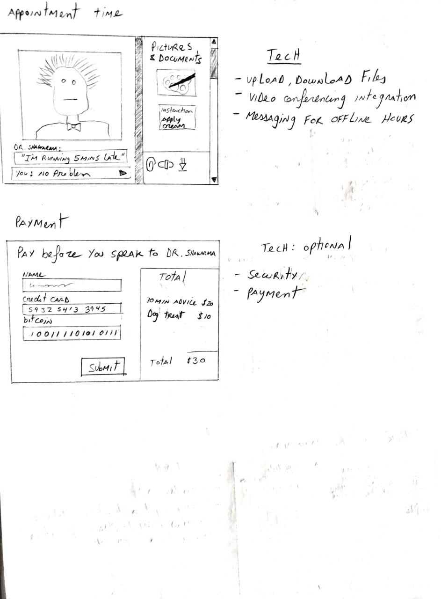

# tele-vet

## Who are we?

- Kaavya: R2Q7
- Amy: U5X9A
- Francois: J1H1B
- Nick: T9F2B

## Who is this for?

Tele-Vet is a tele-health web app designed to connect vets with their furry patients. A user can view vet profile pages by location, upload relevant documents (images, text files, etc), and video conference with a vet.

## What will our app do?

It will connect vets and pet owners virtually with video conferencing and messaging.
Pet owners can:
- Undergo a pre-screening using a chatbot to indicate the level of urgency and preliminary info
- Search for vets by location
- Book an appointment with a vet
- View a vet's availability
- Message vets in real-time
- Send and receive private messages to a message inbox
- Upload images
- Video conference with vets
- View message log history with vets
- Receive a summary of the appointment from the vet
- Receive prescriptions from the vet that can be downloaded as a pdf for printing and collecting

Vets can:
- Send and receive private messages to a message inbox
- View calendar and book patients through Google Calendar or Outlook or Apple Calendar
- View message log history with patients 
- Send notes and prescriptions
- View patient uploaded images
- View preliminary info on patients from pre-screening
- View existing patient files

## What type of data will we store?

We will store patient profile data: 
Pet Owners:
- Name
- Contact information
- Address
- Message History
- List of pets

Pets:
- Name
- Owner
- Species
- Breed
- Address
- Uploaded images
- Files (patient history, prescription history, pre-existing conditions, etc)

Vets:
- Vet name
- Clinic contact information
- Vet clinic location
- Address
- Uploaded images of the clinic or staff
- Staff profiles
- Some certificate proving the vet is real
- Message history
- Prescription history etc

## What will users be able to do with the data?

Pet owners can retrieve message log, prescriptions and uploaded images. Vets can retrieve message log, patient file, and uploaded images.

## Minimal Requirements
- Database storage
- User and vet accounts
- external log-in manager
- Search for vets by location (google map integration)
- View a vet's availability

## Standard Requirements
- Booking/viewing appointment
- Send and receive private messages to a message inbox
- Realtime messaging between patients and vets
- Embedded video portal
- Upload images

## Stretch Requirements
- Integrate booking with external calendars (google Cal, Outlook, Apple Cal)
- Payment integration
- Pre-screening chatbot

## Breakdown of minimal requirements
- Database Storage
    1. Set up a database
    2. Create a REST service in the backend that will provide endpoints for accessing the database, so we can access the
        data with frontend AJAX requests.

- external log-in manager
    1. Choose an Oauth2.0 provider (Auth0 is free for up to 7k users https://auth0.com/). We don't want to manage this ourselves.
    2. Set up account (details depend on provider).
    3. Integrate into web app.

## Prototypes

## Available Scripts

In the project directory, you can run:

### `yarn start`

Runs the app in the development mode. 
Open [http://localhost:3000](http://localhost:3000) to view it in the browser.

The page will reload if you make edits. 
You will also see any lint errors in the console.

### `yarn test`

Launches the test runner in the interactive watch mode. 
See the section about [running tests](https://facebook.github.io/create-react-app/docs/running-tests) for more information.

### `yarn build`

Builds the app for production to the `build` folder. 
It correctly bundles React in production mode and optimizes the build for the best performance.

The build is minified and the filenames include the hashes. 
Your app is ready to be deployed!

See the section about [deployment](https://facebook.github.io/create-react-app/docs/deployment) for more information.

### `yarn eject`

**Note: this is a one-way operation. Once you `eject`, you can’t go back!**

If you aren’t satisfied with the build tool and configuration choices, you can `eject` at any time. This command will remove the single build dependency from your project.

Instead, it will copy all the configuration files and the transitive dependencies (webpack, Babel, ESLint, etc) right into your project so you have full control over them. All of the commands except `eject` will still work, but they will point to the copied scripts so you can tweak them. At this point you’re on your own.

You don’t have to ever use `eject`. The curated feature set is suitable for small and middle deployments, and you shouldn’t feel obligated to use this feature. However we understand that this tool wouldn’t be useful if you couldn’t customize it when you are ready for it.

## Learn More

You can learn more in the [Create React App documentation](https://facebook.github.io/create-react-app/docs/getting-started).

To learn React, check out the [React documentation](https://reactjs.org/).

### Code Splitting

This section has moved here: https://facebook.github.io/create-react-app/docs/code-splitting

### Analyzing the Bundle Size

This section has moved here: https://facebook.github.io/create-react-app/docs/analyzing-the-bundle-size

### Making a Progressive Web App

This section has moved here: https://facebook.github.io/create-react-app/docs/making-a-progressive-web-app

### Advanced Configuration

This section has moved here: https://facebook.github.io/create-react-app/docs/advanced-configuration

### Deployment

This section has moved here: https://facebook.github.io/create-react-app/docs/deployment

### `yarn build` fails to minify

This section has moved here: https://facebook.github.io/create-react-app/docs/troubleshooting#npm-run-build-fails-to-minify
